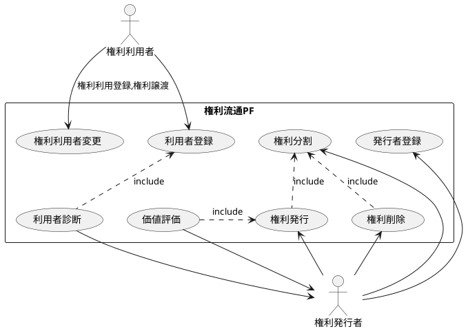
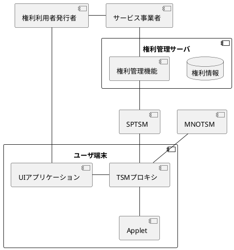
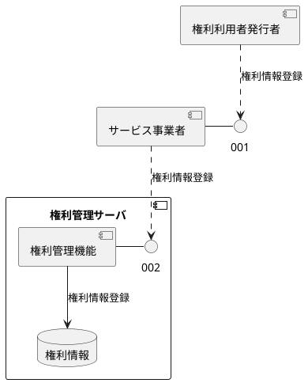
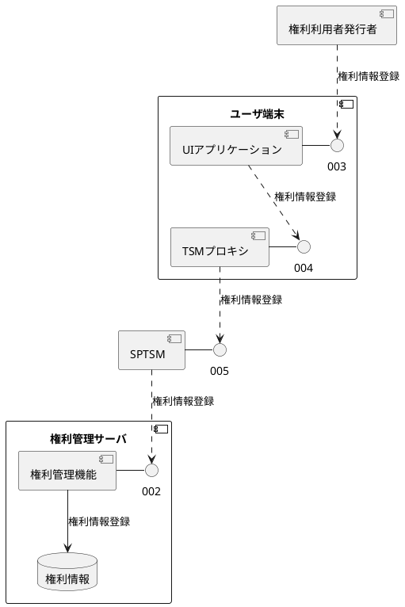
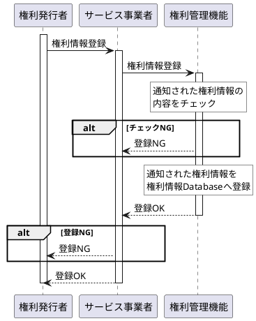
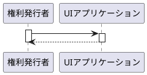

# ユースケース図

## ユースケース一覧

| ユースケース名 | 概要 |
|---|---|
| 権利発行 | 権利を所有するユーザ又はサービス事業者が権利情報を権利流通PFに登録することにより、 権利利用者が権利の利用登録をすることにより権利の利用を可能とする。 |
| 権利利用者変更 | 権利利用者が権利を利用可能とするために、権利の利用権の所有者を変更する。 |
| 権利分割 | 権利発行者が権利の分割利用を可能とするため、権利を分割する。 ex. 駐車場の1日単位貸し→駐車場15分単位へ変更 |
| 権利削除
| 利用者登録
| 利用者診断
| 価値評価
| 発行者登録

# コンポーネント図

## コンポーネント一覧

| コンポーネント名 | 機能概要 |
|---|---|
| 権利利用者/発行者 | 権利を利用するユーザ、権利を発行するユーザ |
| サービス事業者 | 権利発行、検索、利用予約のIFを権利利用者、発行者に提供する。 |
| 権利管理サーバ | 権利情報を一元管理する。 |
| SP-TSM |  |
| MNO-TSM |  |
| サービス事業者 |  |
| サービス事業者 |  |

## 権利発行

権利発行者がサービス事業者のAPIを経由して権利情報を登録する場合。

権利発行者が自端末のUIアプリケーションのAPIを経由して権利情報を登録する場合。

## IF一覧

| IF通番 | IF保有CP | IF利用CP | プロトコル | 用途 |
|---|---|---|---|---|
| 001 | サービス事業者 | 権利利用者発行者 | HTML(REST) | 権利発行,変更,削除,検索 |
| 002 | 権利管理サーバ | サービス事業者 SP TSM | HTML(REST) |  権利発行,変更,削除,検索 |
| 003 | UIアプリケーション | 権利利用者発行者 | GUI |  権利発行,検索,利用登録 |
| 004 | TSMプロキシ | UIアプリケーション | HTML(REST) |  HTML(REST)プロキシ |
| 005 | SP TSM | TSMプロキシ | HTML(REST) | 権利発行,変更,削除,検索  |

# シーケンス図
## 権利発行(サービス事業者経由)
- 処理概要
権利所有者がサービス事業者を経由して権利を発行する。

## 権利発行(UIアプリ経由)
- 処理概要
権利所有者がUIアプリを使用して権利を発行する。

## 検討事項
1. 権利情報のマスターをUICCに持つかそれとも権利管理サーバに持つか。

| 方式 | 機能性 | 信頼性 | 使用性 | 効率性 | 保守性 | 移植性 |
|---|---|---|---|---|---|---|
| UICCに権利情報保持 |   |   |   |   |   |   |
| 権利管理サーバに権利情報保持 |   |   |   |   |   |   |

2. aaa
