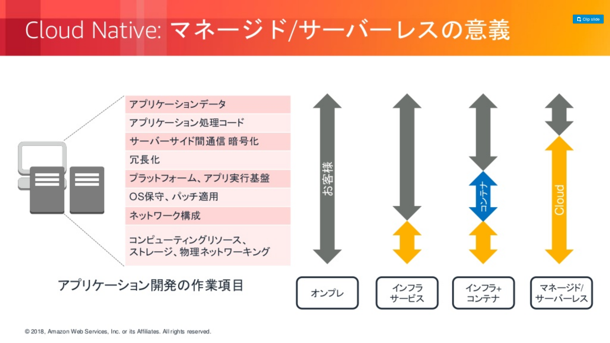
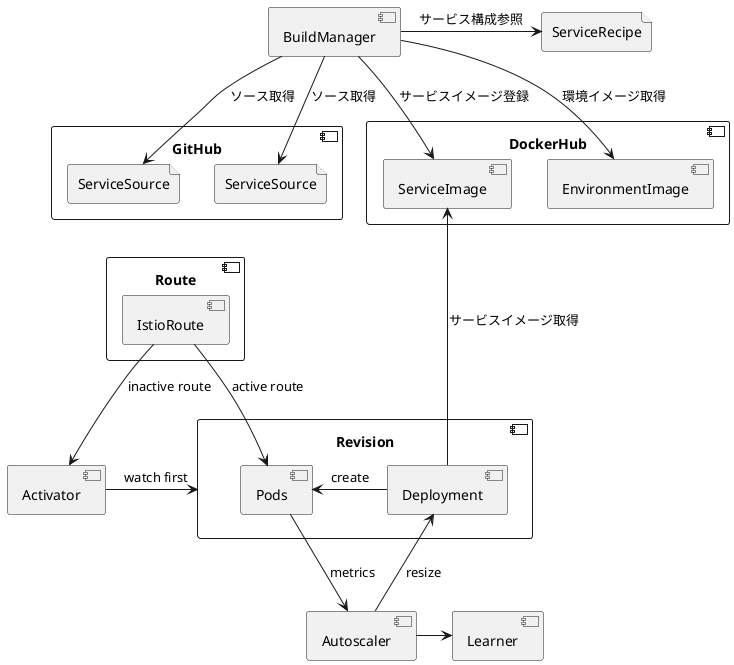
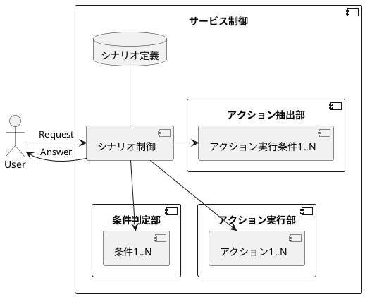
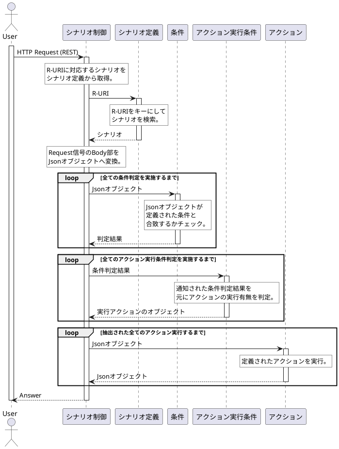

# 目的・背景
クラウド環境でアプリケーションを実装する際には、VMまたはコンテナ環境を意識したOSの保守、パッチやプラグ適用、冗長化、スケール(AWSではEC2インスタンスの数に応じて課金されるため、どのくらいインスタンスを用意しておくかはスケール上限下限も含めて運用者がサービス負荷を予測して決める。)の考慮、サーバ、コンテナの準備を行う必要があるが、サーバレスアーキテクチャを適用した場合、それらの作業が一切不要とすることができるため、保守稼働を大きく減らすことができ、サービスロジックの開発に専念することができる。(下図参照)
しかし、サーバレスアーキテクチャでは以下のようにいくつかの制約が発生してしまう。
1.  実行時間制約が存在する(コンテナ生存時間が限られるため再利用が難しい)
1. イベント受信後にコンテナを起動するため実行時間にオーバヘッドがある

これらの制約を解決するためのフレームワークを提供する。



# システム概要
本システムはコンテナベースのクラウドプラットフォームを提供する。Data Strageや分散メッセージ等の一般的なクラウドプラットフォームで提供されている機能についてもサービスとして提供可能とする。1. の課題については他サービスとの組み合わせで解消可能である。2. 3. の課題についてはサービストラヒックを予測し、サービスインスタンスの起動数と適切な継続動作時間を決定することで、事前に適切な数のインスタンスを起動しておくことで解決する。

# 機能一覧

以下にプラットフォームで提供する主要サービスの一覧を示す。

| 機能名 | 機能詳細 | 実現OSS |
|------------------|-------------|------------|
| API Gateway | Request信号の認証、Residentコンテナへのロードバランスを行う。どのコンテナが処理中かの情報も判断し、負荷を分散する。また、Residentコンテナ起動時はロードバランス対象としてREST API経由で追加する。  | Nginx or HAProxy or MetalLB or VPP |
| Scheduler | 特定の時刻、日付等の時刻を基準にして実行されるバッチジョブを制御する。 | kubernetes(Cronjob / Job) |
| 分散バッチ処理 | 大規模なバッチ処理を分散して並列実行を可能とする。 | Flink or Spark |
| DataBase | 分散RDBを提供するサービス。 | Vitess and MySQL or MySql Cluster |
| Key Value Store | 分散KVSを提供するサービス。 | Maestro + Redis |
| 分散ストリーミング | 分散ストリーミング処理基盤を提供するサービス。 | Flink or Stom or Spark Streaming |
| 分散メッセージング | 分散メッセージ送受信機能を提供するサービス。 | kafka or Nats |
| ログ・メトリクス収集 | 障害ログ、トラヒックログ等の各種ログを取得し、ログの内容を編集しログ、メトリクス格納機能部へ渡す。 | Fluentd or Logstash |
| ログ・メトリクス格納、検索 | 障害ログ、トラヒックログの保存を行うとともに、他サービス、保守者に対してログ、メトリクスの検索機能も提供する。また異常なログを検出した際には異常アラートを通知する。 | Elasticsearch and ElastAlert |
| ログ・メトリクス可視化 | 収集して蓄積したログ、メトリクスを可視化する。 | kibana |
| サービスメッシュ | サービス間をフルメッシュで接続し、サービス間の通信、メトリクスの取得を可能とする。また、サーキットブレーカー等の異常時の処理やサービスのカナリーリリース等のサービスデプロイメントも可能とする。 | Istio |
| 機械学習基盤 | Deep Learning等の様々な機械学習を実施可能とする。 | tensorflow + jupyter |
| サーバレスアーキテクチャプラットフォーム | イベント駆動でのコンテナ起動を行う。サービスのメトリクスの情報を参照し、Auto Scale in/outを行う | Knative or Kubeless or Fission|
| コンテナプラットフォーム | 各サービスのコンテナを動作させるプラットフォーム基盤 |Kubernetes |
| SDNコントローラ | 仮想スイッチにフロー設定やQoS設定、Meter設定を行う。 | OpendayLight or Ryu |
| 仮想スイッチ | データ転送やデータフロー制御を行う仮想スイッチ。 | Openvswitch and DPDK or VPP |

# サーバレスアーキテクチャプラットフォーム
現在実装されているプラットフォームはメトリクスを見て、インスタンスが足りなくなればスケールアウトするモデルだが、過去のメトリクスからサービスの負荷を学習し、インスタンスの事前起動を行うように変更を行う。下図にKnativeのServingコンポーネントのアーキテクチャを示す。
メトリクスを元にAuto Scaleの判定を行っているのはAutoScalerであるため、ここを学習機能と連携できるように変更する。
できれば複数サービスのメトリクスから依存関係を分析しそれも考慮に入れた上でオートスケールできることが望ましい。(例えば、ECサイトの商品参照サービスへのアクセスが急増した場合、ECサイトの商品購入サービスへのアクセスも増加する可能性があるため、商品参照サービスのトラヒック増加を検出した際に商品購入サービスもスケールアウトを自動的に行うようにする等の他サービスとの関連を自動で判別しスケール動作ができるようにする等)



# サービスフレームワーク部




## アクション実行判定条件
アクションを実行するかどうかの条件判定表は下表のような表を作成する。

| Action | 条件1 | 条件2 | 条件3 | 条件4 | 条件5 |
|---|---|---|---|---|---|
|Action1 | ○ |-|-|-|-|
|Action2 |○|-|○|-|×|
|Action3 |-|-|○|×|-|
|Action4 |-|-|-|×|×|
|Action5 |-|-|-|○|○|

上記の表をJson文に変換して保持しておく。

```
{
  DecideAction : [
    {
      ActionID : 1,
      Condition : [
        {
          ConditionID : 1,
          Bool : true
        }
      ]
    },
    {
      ActionID : 2,
      Condition : [
        {
          ConditionID : 1
          bool : true
        },
        {
          ConditionID : 3
          bool : true
        },
        {
          ConditionID : 5
          bool : false
        }
      ]
    }
  ]
}
```


```
package main

import (
  "fmt"
  "reflect"
  "encoding/json"
  "plugin"
  "context"
)

func main() {
  //Request受信
  //Context生成
  ctx := context.Background()
  //ライブラリ読み込み
  //ファイル名はユーザに入力してもらう。(今回は決め打ち)
  l_Plugin, _ := plugin.Open("./solib.so")
  l_Function, _ := l_Plugin.Lookup("MyFunction")
  l_Input, _ := l_Plugin.Lookup("NewInput")
  fmt.Println("reflect.TypeOf(l_Input): ",reflect.TypeOf(l_Input))
  l_NewInterface := l_Input.( func() ( interface{} ) )()
  fmt.Println("reflect.TypeOf(l_NewInterface): ",reflect.TypeOf(l_NewInterface))
  //InputとなるJsonデータ
  jsonString := `{"Name":"test"}`

  ctx = context.WithValue( ctx, "Request", jsonString)

  json.Unmarshal([]byte(jsonString), l_NewInterface)
  fmt.Println("l_NewInterface: ",l_NewInterface)

  l_bool,_ := l_Function.( func( context.Context, interface{} ) ( bool,error ) )( ctx, l_NewInterface )
  fmt.Println("Function Result: ", l_bool )

  fmt.Println( "ctx.Value( Request ).(string): ", ctx.Value( "Request" ).(string) )

}
```
```
package main

import(
  "fmt"
  "context"
  "encoding/json"
)

type MyInput struct {
  Name string `json:"Name"`
}

type MyInput2 struct {
  ConvertName string `json:"Name"`
}

func NewInput() ( interface{} ){
  return new(MyInput)
}

func MyFunction( ctx context.Context, inputParam interface{} ) (bool, error) {
  l_InputParam := inputParam.(*MyInput)
  l_InputByte,_ := json.Marshal(inputParam)
  var l_InputParam2 MyInput2
  json.Unmarshal(l_InputByte, &l_InputParam2)
  fmt.Println( "l_InputParam.Name: ",l_InputParam.Name )
  fmt.Println( "l_InputParam2.Name:",l_InputParam2.ConvertName )
  fmt.Println( "ctx.Value(Request).(string)",ctx.Value("Request").(string) )

  return true , nil
}
```
