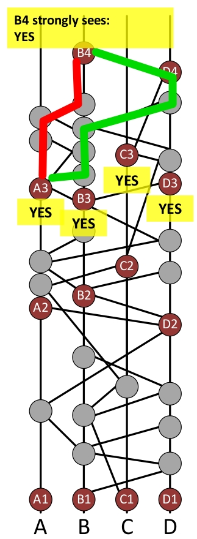
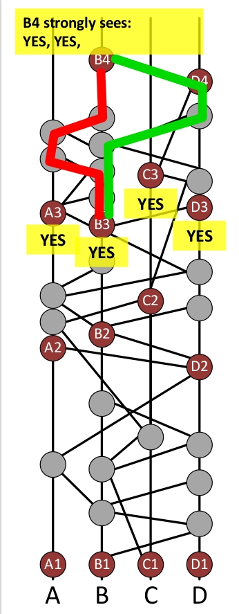

# HashGraph Consensus Example

This figure is a hashgraph.
```
この図はハッシュグラフです。
```
It grows upward over time.
```
それは時間の経過とともに上向きに成長します。
```
Every participant keeps a copy of it in memory.
```
すべての参加者はそれのコピーをメモリに保存します。
```
In this example, there are four members (full nodes) in the network.
```
この例では、ネットワーク内に4つのメンバー（フルノード）があります。
```
The members are Alice, Bob, Carol, Dave, and are represented by the 4 lines labeled A, B, C, D.
```
メンバーはAlice、Bob、Carol、Daveで、A、B、C、Dという4つの行で表されます。
```
Each member starts by creating an event, which is a small data structure in memory, and which is represented here by a gray circle.
```
各メンバーは、メモリ内の小さなデータ構造であり、ここでは灰色の円で表されるイベントを作成することから始めます。
```
Each event is a container for zero or more transactions.
```
各イベントは、0個以上のトランザクションのコンテナです。
```
The goal of the Swirlds hashgraph consensus algorithm is for the members of the community to come to a consensus (agreement) on the order of the events (and thus the order of transactions inside the events), and to agree on a timestamp for each event (and so for each transaction).
```
Swirldsハッシュグラフ合意アルゴリズムの目的は、コミュニティのメンバーがイベントの順序
（したがってイベント内のトランザクションの順序）について合意（合意）し、
各イベントのタイムスタンプについて合意することです。 （そして各トランザクションについても同様）。
```
It should be hard for attackers to prevent consensus, or to force different members to come to a different “consensus”, or to unfairly influence the order and timestamps that are agreed.
```
攻撃者がコンセンサスを妨げたり、異なるメンバーに異なる「コンセンサス」を強制したり、
合意された順序やタイムスタンプに不当に影響を与えることは困難です。
```

The community runs a gossip protocol, which means that each member repeatedly calls others at random to sync with them.
```
コミュニティはゴシッププロトコルを実行します。つまり、各メンバーはランダムに他のメンバーに電話をかけて同期します。
```
In this case, Bob randomly chose to call Dave.
```
この場合、BobはランダムにDaveを呼び出すことを選択しました。
```
When they connected over the internet, Bob sent Dave all the events he knew that Dave did not yet know.
```
彼らがインターネットを介して接続したとき、ボブはデイブがまだ知らないすべての出来事をデイブに送った。
```
In this case, it was just one event: the one that Bob had created at the start.
```
この場合、それはただ1つのイベントでした。ボブが最初に作成したものです。
```
Dave records the fact that this sync happened by creating a new event.
```
Daveは、この同期が新しいイベントを作成することによって行われたという事実を記録します。
```
This is the new circle, which has lines going straight down to his own last event, and diagonally down to Bob’s last event.
```
これは新しい円で、直線は彼自身の最後のイベントまで、そして斜めにボブの最後のイベントまで続いています。
```
Thus, the graph of events forms a record of how the members have communicated.
```
したがって、イベントのグラフは、メンバーがどのように伝達したかの記録を形成します。
```
- TECHNICAL DETAIL
Bob can avoid sending Dave events he already knows.
    ```
    ボブは、彼がすでに知っているDaveイベントを送信することを避けることができます。
    ```
    Bob first tells Dave how many events he knows about that were created by each member (i.e., 4 integers).
    ```
    ボブは最初に、彼がそれについて知っているイベントが各メンバーによっていくつ発生したかをDaveに伝えます（すなわち、4つの整数）。
    ```
    Dave tells Bob the same.
    ```
    デイブはボブに同じことを言う。
    ```
    Then they will both know exactly which events each should send the other.
    ```
    それから、両者はどちらのイベントがお互いに送信するべきかを正確に知るでしょう。
    ```
    If Bob has 13 events by Alice and Dave has 10, then Bob sends Alice’s last 3 events.
    ```
    ボブがアリスによる13のイベントを持ち、デイブが10のイベントを持っている場合、ボブはアリスの最後の3つのイベントを送ります。
    ```


Dave’s new event is illustrated here.
```
Daveの新しいイベントがここに示されています。
```
An event is a data structure containing the two hashes of the two events below itself (its self-parent and its other-parent).
```
イベントは、それ自身の下にある2つのイベントの2つのハッシュを含むデータ構造体です（自己の親と他の親）。
```
In this case, the self-parent is Dave’s first event, and the other-parent is Bob’s first event.
```
この場合、自分の親がDaveの最初のイベントで、もう一方の親がBobの最初のイベントです。
```
The event can optionally contain zero or more transactions that Dave wants to send to the network.
```
イベントには、Daveがネットワークに送信したいトランザクションを0個以上含めることができます。
```
So an event is a container for transactions.
```
そのため、イベントはトランザクションのコンテナです。
```
Dave also puts a timestamp of when he created the event. He then digitally signs it.
```
Daveはまた、イベントを作成したときのタイムスタンプも付けます。 それから彼はそれにデジタル署名します。
```
When this event is gossiped, the signature will be sent along with it.
```
このイベントがゴシップ化されると、署名も一緒に送信されます。
```


Dave then sends Bob all his events (including the new one he just created).
```
次にDaveは、自分が作成した新しいイベントも含めて、自分のすべてのイベントをBobに送信します。
```
Bob then creates a new event recording the fact they synced, and including the hashes of the most recent event by himself and the most recent event by Dave.
```
次にボブは、同期した事実を記録した新しいイベントを作成します。
自分自身による最新のイベントとDaveによる最新のイベントのハッシュも含まれます。
```


Bob then randomly chooses Alice, and sends her all 4 events he knows about.
```
次にボブはランダムにアリスを選び、彼が知っている4つのイベントすべてを彼女に送ります。
```
She creates a new one.
```
彼女は新しいものを作ります。
```


This continues forever, growing a directed acyclic graph upwards forever.
```
これは永遠に続き、有向非巡回グラフを永遠に上向きに成長させます。
```
This is a graph connected by cryptographic hashes, so it is called a hashgraph.
```
これは暗号化ハッシュによって接続されたグラフなので、ハッシュグラフと呼ばれます。
```
Each event contains the hashes of the events below it and is digitally signed by its creator.
```
各イベントには、その下のイベントのハッシュが含まれており、作成者によってデジタル署名されています。
```
So the entire graph of hashes is cryptographically secure.
```
したがって、ハッシュのグラフ全体は暗号的に安全です。
```
It can always grow, but the older parts are immutable, as strong as the cryptographic hash and signature system used.
```
それは常に成長する可能性がありますが、古い部分は不変であり、使用される暗号化ハッシュおよび署名システムと同じくらい強力です。
```


It is useful to define a round created for each event.
```
各イベントに対して作成されたラウンドを定義すると便利です。
```
A child never has a round created before one of its parents.
```
子供がその親のうちの1人の前にラウンドを作成することはありません。
```
So as time flows upward in the diagram, the round created can only stay the same or increase.
```
そのため、ダイアグラムで時間が上向きに流れるにつれて、作成されたラウンドは同じままであるか増加するだけです。
```
A later slide will describe how the round created is calculated.
```
後のスライドで、作成されたラウンドの計算方法について説明します。
```
The important point is that as soon as you receive an event in a sync, you can immediately calculate its round created.
```
重要な点は、同期でイベントを受信したらすぐに、作成したラウンドをすぐに計算できることです。
```
And anyone else receiving it will calculate the same number.
```
そしてそれを受け取った他の誰もが同じ数を計算するでしょう。
```
Guaranteed.
```
保証します。
```
- TECHNICAL DETAIL:
The definition is: the round created for an event is R or R+1, where R is the max of the round created of its parents.
    ```
    定義は次のとおりです。イベントに対して作成されたラウンドはRまたはR + 1です。ここで、Rはその親から作成されたラウンドの最大値です。
    ```
    It is R+1 if and only if it can strongly see a supermajority of round R witnesses.
    ```
    ラウンドRの目撃者の超大多数を強く見ることができる場合に限り、それはR + 1です。
    ```
    This is explained in greater detail in later slides.
    ```
    これについては、後のスライドで詳しく説明します。
    ```


The first event that Alice creates in each round is called a witness.
```
アリスが各ラウンドで作成する最初のイベントは証人と呼ばれます。
```
Her witnesses are labeled A1, A2, and A3 here.
```
彼女の証人はここでA1、A2、そしてA3とラベル付けされている。
```
The other members create witnesses similarly.
```
他のメンバーも同様に証人をつくります。
```
It is possible for a member to have no witnesses in a given round.
```
与えられたラウンドで会員が証人を持つことはできません。
```
- TECHNICAL DETAIL:
It is possible for a member to cheat by forking, or creating two events with the same self parent.
  ```
  メンバーがフォークすること、または同じ親を持つ2つのイベントを作成することによってカンニングすることは可能です。
  ```
  In that case, there might be two witnesses in the same round by the same member.
  ```
  その場合、同じメンバーによる同じラウンドに2人の目撃者がいるかもしれません。
  ```
  There are theorems proving that this won’t matter.
  ```
  これが問題にならないことを証明する定理があります。
  ```


For each witness, we need to determine if it is a famous witness.
```
証人ごとに、それが有名な証人かどうかを判断する必要があります。
```
For example, we will determine if the witness B2 is a famous witness.
```
たとえば、証人B2が有名な証人であるかどうかを判断します。
```
This is done by considering the witnesses in the next round.
```
これは次のラウンドの目撃者を考慮することによって行われます。
```
So the fame of B2 will be determined by first considering the witnesses A3, B3, C3, and D3.
```
したがって、B2の名声は、証人A3、B3、C3、およびD3を最初に検討することによって決定されます。
```
The idea is for B2 to count as famous if it is seen by many of the witnesses in the next round.
```
次のラウンドで多くの目撃者に見られるようになれば、B2は有名であると数えることができます。
```
There is now an election, in which each of those witnesses will vote on whether B2 is famous.
```
今選挙があり、その中でそれらの目撃者のそれぞれがB2が有名であるかどうかについて投票するでしょう。
```
There will be a separate election for every witness, to determine its fame.
```
その名声を決定するために、目撃者ごとに別々の選挙があります。
```


The witness A3 can see B2. That means that there is an entirely-downward path from A3 to B2.
```
証人A3はB2を見ることができます。 つまり、A3からB2への完全に下向きのパスがあるということです。
```
In other words, B2 is an ancestor of A3.
```
言い換えれば、B2はA3の先祖です。
```
And A3 is a descendent of B2 A3 can see B2, so A3 will vote YES in the election for whether B2 is famous.
```
そしてA3はB2の子孫ですA3はB2を見ることができるので、A3はB2が有名であるかどうかのために選挙でYESに投票します。
```
- TECHNICAL DETAIL:
A3 sees all its ancestors except for those created by a member who created a fork that is an ancestor of A3.
  ```
  A3は、A3の先祖であるフォークを作成したメンバーによって作成されたものを除いて、そのすべての先祖を見ます。
  ```
  In other words, A3 can see B2 if B2 is an ancestor of A3, and the creator of B2 (who is Bob) did not create two events X and Y that both have the same self-parent and are both ancestors of A3.
  ```
  つまり、B2がA3の先祖であり、B2の作成者（Bob）が、同じ親を持ち、
  両方ともA3の先祖である2つのイベントXとYを作成しなかった場合、A3はB2を見ることができます。
  ```
  So “seeing” is the same as “ancestor”, except you can’t “see” cheaters.
  ```
  つまり、「見る」ことは「祖先」と同じです。ただし、不正行為者を「見る」ことはできません。
  ```


B3 sees B2, so it votes YES. C3 sees B2, so it votes YES.
```
B3はB2を見ているので、YESと投票します。 C3はB2を見ているので、YESと投票します。
```
 

D3 sees B2, so it votes YES.
```
D3はB2を見ているので、YESと投票します。
```
All four witnesses voted YES, so we would expect that B2 will be declared to be famous.
```
4人の証人全員がイエスに投票したので、B2が有名になると宣言されるでしょう。
```
But the election isn’t over yet! An election isn’t over until the votes are counted.
```
しかし、選挙はまだ終わっていません！ 投票がカウントされるまで選挙は終わらない。
```
The votes will be counted by the witnesses in the following round.
```
投票は次のラウンドで証人によってカウントされます。
```
So B4 will count the votes. And D4 will also count the votes.
```
だからB4は票を数えるでしょう。 そしてD4も投票を数えます。
```
The hashgraph doesn’t yet have an A4 or C4.
```
ハッシュグラフにはまだA4またはC4がありません。
```
But as time goes on and more gossiping occurs, there may eventually be an A4 and C4, and then they will count the votes, too.
```
しかし、時間が経つにつれてゴシップが発生するにつれて、最終的にはA4とC4が発生する可能性があり、その後、投票数もカウントされます。
```


B4 will collect the votes from every round-3 witness that it strongly sees.
```
B4は、それが強く見ているすべてのラウンド3目撃者から投票を集めるでしょう。
```
To strongly see a witness, it isn’t enough for there to be a single downward path to it.
```
目撃者を強く見るためには、それへの単一の下向きの道があるだけでは十分ではありません。
```
There must be enough different paths to it so that together, the paths go through a supermajority of the population.
```
一緒になって、その道が人口の超大多数を通るように、それへの十分に異なる道がなければなりません。
```
A supermajority is any number that is more than two thirds of the population. In this example, there are 4 members in the population, so any 3 of them constitute a supermajority.
```
超大衆とは、人口の3分の2を超える数です。この例では、母集団に4人のメンバーがいるので、そのうちの3人は超大多数を構成します。
```
In this example, B4 is able to strongly see A3.
```
この例では、B4はA3を強く見ることができます。
```
The red path goes from B4 to A3 through Alice and Bob.
```
赤い道はアリスとボブを通ってB4からA3に行きます。
```
The green path goes through Alice, Bob, and Dave. There are no paths from B4 that go through Carol to get to A3.
```
緑の道はアリス、ボブ、そしてデイブを通ります。キャロルを通過してA3に到達するB4からのパスはありません。
```
But that’s OK, because Alice, Bob, and Dave make up a supermajority.
```
しかし、それは問題ありません。アリス、ボブ、そしてデイブが大部分を占めているからです。
```
So Carol isn’t needed.
```
だからキャロルは必要ない。
```
In fact, the green path alone would have been enough.
```
実際には、グリーンパスだけで十分でしょう。
```
The red path wasn’t needed.
```
赤い道は必要ではなかった。
```
So, B4 can strongly see A3. Therefore, B4 collects the vote from A3 (which is YES).
```
それで、B4はA3を強く見ることができます。したがって、B4はA3から投票を収集します（YES）。
```


B4 strongly sees B3, because the red path goes through Alice and Bob, and the green path goes through Bob and Dave.
```
赤い道はアリスとボブを通り、緑の道はボブとデイブを通るので、B4はB3を強く見ます。
```
In this case, both paths were needed to reach the supermajority.
```
この場合、両方の経路が超大多数に到達するために必要でした。
```
B4 strongly sees C3, and so collects another YES vote.
```
B4はC3を強く見ているので、別のYES投票を集めます。
```
- TECHNICAL DETAIL:
if a path starts at Bob and ends at Carol, then it automatically counts as going through Bob and Carol.
  ```
  パスがボブで始まりキャロルで終わる場合は、自動的にボブとキャロルを通るものとしてカウントされます。
  ```
  In other words, the endpoints of the path are counted, too.
  ```
  つまり、パスの終点もカウントされます。
  ```
B4 strongly sees D3, and so collects another YES vote.
```
B4はD3を強く見ているので、別のYES投票を集めます。
```
  

At this point, B4 has received YES notes from a supermajority, so B4 decides that the election result is YES.
```
この時点で、B4は超大多数からYESのメモを受け取っているので、B4は選挙結果がYESであると判断します。
```
Color B2 green to show that it is now famous.
```
それが今有名であることを示すためにカラーB2グリーン。
```
That is the consensus decision.
```
それが合意の決定です。
```
If B4 had seen 3 YES and 1 NO, it would still decide YES, because that’s a supermajority.
```
もしB4が3つのYESと1つのNOを見たなら、それはまだYESと決定するでしょう、それはそれが超大国であるので。
```
If B4 had seen 3 YES votes and no other votes (because it couldn’t strongly see one of the witnesses), it would still decide YES, because that’s a supermajority.
```
B4が3人のYES票を見て、他の票を見たことがなければ（証人の1人を強く見ることができなかったので）、
それでもYESを決定するでしょう。それは超大国であるためです。
```
We need for B4 to strongly see a supermajority of witnesses, in order to even have a chance at deciding.
```
決断を下すチャンスさえも得るために、私たちはB4が証人の超大多数を強く見ることが必要です。
```
Therefore, we use this to define the round created.
```
したがって、作成したラウンドを定義するためにこれを使用します。
```
If an event X has parents with a maximum round created of R, then that event will usually be round R, too.
```
イベントXがRで作成された最大ラウンドを持つ親を持つ場合、そのイベントは通常Rラウンドでもあります。
```
But if that event can strongly see a supermajority of round R witnesses, then that event is defined to be round R+1, and so is a witness.
```
しかし、その出来事がラウンドRの目撃者の超大多数を強く見ることができるのであれば、
そのイベントはラウンドR + 1であると定義されているので、証人でもあります。
```
In other words, an event is promoted to the next round when it can strongly see a supermajority of witnesses in the current round.
```
言い換えれば、あるイベントが次のラウンドに昇格するのは、現在のラウンドで非常に多くの目撃者がいることを強く示しているからです。
```


Now we run an election for whether C2 is famous.
```
今度は、C2が有名かどうかの選挙を行います。
```
The yellow path shows that C3 can see C2, and so C3 votes yes.
```
黄色のパスは、C3がC2を認識できることを示しているため、C3は「はい」と投票します。
```
There are no downward paths from A3, B3, or D3 to C2, so they all vote NO.
```
A3、B3、またはD3からC2への下向きのパスはありません。したがって、これらはすべてNOと投票します。
```
Since B4 strongly sees all of A3, B3, C3, and D3, it will therefore collect votes from all of them.
```
B4はA3、B3、C3、およびD3のすべてを強く認識しているので、したがってそれらのすべてから投票を収集します。
```
The votes are NO, NO, YES, NO.
```
投票は、NO、NO、YES、NOです。
```
So a supermajority is NO.
```
それで、超大多数はNOです。
```
So it decides NO.
```
それでそれはNOを決定します。
```
The election is over.
```
選挙は終わりました。
```
C2 is not famous. Color it blue to show that it is not famous.
```
C2は有名ではありません。 それが有名でないことを示すためにそれを青に着色してください。
```
 

There is a theorem that if any witness is able to “decide” yes or no, then that is the result of the election, and it is guaranteed that all other witnesses that decide are going to decide the same way.
```
いずれかの証人が「はい」または「いいえ」を「決定」することができれば、
それが選挙の結果であり、決定する他のすべての証人が同じように決定することが保証されるという定理があります。
```
In this example, B4 was able to decide the election.
```
この例では、B4が選挙を決めることができました。
```
If it had collected votes that were more evenly split between YES and NO, then it would have failed to decide.
```
もしそれがYESとNOの間でより均等に分割された投票を集めていたら、それは決定に失敗したでしょう。
```
In that case, we can consider D4. If D4 also fails to decide, then perhaps A4 or C4 might decide.
```
その場合、D4を検討できます。 D4も決定できない場合は、おそらくA4またはC4が決定する可能性があります。
```
If none of the round-4 witnesses can decide, then each of them will simply vote in accordance with the majority of the votes they collected (voting YES in case of a tie).
```
第4ラウンド目撃者の誰もが決定することができないならば、
それから彼らのそれぞれは単に彼らが集めた投票の大半に従って投票するでしょう（同点の場合YES）。
```
In that case, it will be up to the round-5 witnesses to collect votes from the round-4 witnesses.
```
その場合、第4ラウンド目撃者から投票を集めるのは第5ラウンド目撃者になります。
```
Perhaps the round-5 witnesses will be able to decide.
```
おそらく第5ラウンド目撃者が決めることができるでしょう。
```
The voting continues until it eventually reaches a round where some witness can decide the election.
```
投票は最終的に何人かの目撃者が選挙を決定できるラウンドに達するまで続きます。
```
There is a theorem saying that the election will eventually end (with probability one) as long as we add in a coin round every 10 th round of voting.
```
投票の10ラウンドごとにコインラウンドを追加する限り、選挙は最終的に（確率1で）終了するという定理があります。
```
In a coin round, collecting a supermajority causes a witness to merely vote (not decide).
```
コインラウンドでは、超大多数を集めると、証人は単に投票するだけになります（決定しません）。
```
And a non-supermajority causes it to vote pseudorandomly, by using the middle bit of its own signature as its vote.
```
そして、非超大国主義は、それ自身の署名の真ん中のビットをその投票として使用することによって、それを疑似ランダムに投票させる。
```


6 more elections are run. They decide that A2, D2, A1, B1, C1, and D1 are all famous.
```
さらに6選挙が実行されます。 彼らは、A2、D2、A1、B1、C1、およびD1がすべて有名であると決定します。
```
In normal operation, most events are not witnesses, so there is no election for most events.
```
通常の運用では、ほとんどのイベントは目撃者ではないため、ほとんどのイベントに選挙はありません。
```
And most witnesses are declared famous with an almost-unanimous vote in the first round of voting.
```
そして、ほとんどの目撃者は、投票の最初のラウンドでほぼ全会一致の投票で有名に宣言されています。
```
So most elections do not last very long.
```
だからほとんどの選挙はそれほど長くは続かない。
```
Notice that in this example, we have now decided the fame of every witness in round 2.
```
この例では、第2ラウンドですべての証人の名声を決めました。
```
Once a round has the fame decided for all of its witnesses, it is possible to find the round received and find the consensus timestamp for a new set of events.
```
あるラウンドでその証人全員の名声が決定したら、受け取ったラウンドを見つけて、
新しい一連のイベントの合意タイムスタンプを見つけることができます。
```
Start by considering the gray event immediately below A2.
```
A2のすぐ下のグレーのイベントを検討することから始めます。
```
- TECHNICAL DETAIL:
If a member forks, they might have two famous witnesses in the same round.
  ```
  メンバーがフォークする場合、彼らは同じラウンドに2人の有名な目撃者を持つかもしれません。
  ```
  In that case, neither of them are used further.
  ```
  その場合、どちらもそれ以上使用されません。
  ```
  Only the remaining ones (the “unique famous witnesses”) are used to determine round received and consensus timestamp.
  ```
  残りの1人（「ユニークな有名な証人」）だけが、受信ラウンドと合意タイムスタンプの決定に使用されます。
  ```


This event can be seen by every famous witness in round 2.
```
この出来事は、ラウンド2のすべての有名な目撃者に見られます。
```
The red, green, and blue paths show how A2, B2, and D2, respectively, can all see the black event.
```
赤、緑、青のパスは、それぞれA2、B2、D2が黒のイベントをどのように認識できるかを示しています。
```
This merely requires seeing, not strongly seeing.
```
これは単に見ることを要求し、強く見ることは要求しません。
```
This only requires seeing by the famous witnesses.
```
これはただ有名な目撃者によって見ることを必要とします。
```
It doesn’t matter whether C2 can see the black event, because C2 is not famous.
```
C2が有名ではないので、C2が黒のイベントを見ることができるかどうかは重要ではありません。
```
Since the black event is seen by all of the famous witnesses in round 2 (but not in any earlier round), it is said to have a round received of 2.
```
黒の出来事は第2ラウンドで有名な目撃者全員に見られますが（それ以前のどのラウンドでもそうではありません）、
それは2のラウンドを受けたと言われています。
```
- TECHNICAL DETAIL:
we don’t need to limit ourselves to “seeing”.
  ```
  見ることだけに制限する必要はありません。
  ```
  It is sufficient to use the “ancestor” relationship instead.
  ```
  代わりに「先祖」関係を使用すれば十分です。
  ```
  In other words, at this step, we don’t worry about forking.
  ```
  つまり、この段階では、フォークについて心配する必要はありません。
  ```
The consensus timestamp of the black event can be found as follows.
```
ブラックイベントの合意タイムスタンプは以下のように見つけることができます。
```
Find the earliest event X by Alice that is an ancestor of A2 and a descendent of the black event.
```
A2の祖先であり、黒い出来事の子孫であるAliceによる最も初期の出来事Xを見つけなさい。
```
Similarly, find the earliest event Y by Bob that is an ancestor of B2 and descendent of the black event.
```
同様に、B 2の祖先であり、黒のイベントの子孫であるBobによる最も初期のイベントYを見つけます。
```
And similarly for event Z by Dave.
```
そして、DaveによるイベントZについても同様です。
```
Take the timestamps on the events X, Y, Z that were put in those events by their creators.
```
作成者によってこれらのイベントに追加されたイベントX、Y、Zのタイムスタンプを取得します。
```
Sort all of the timestamps in order.
```
すべてのタイムスタンプを順番に並べ替えます。
```
Take the middle one from the list (or the second of the two middle ones, if there are an even number of them).
```
リストから真ん中のものを選ぶ（偶数の場合は2つの真ん中のもののうち2番目のもの）。
```
This median timestamp is the consensus timestamp for the black event.
```
この中央タイムスタンプは、黒のイベントの合意タイムスタンプです。
```


Now consider the gray event below B2.
```
それではB2の下にある灰色のイベントについて考えてみましょう。
```
It is seen by B2, but not seen by A2 or D2.
```
それはB2によって見られますが、A2またはD2によって見られません。
```
So it was not seen by all the famous witnesses in round 2.
```
それで、それはラウンド2のすべての有名な目撃者によって見られませんでした。
```
So its received round will be later than round 2.
```
そのため、受信したラウンドはラウンド2より遅くなります。
```
Leave it colored gray to indicate that it doesn’t yet have a received round.
```
まだ受信ラウンドが行われていないことを示すために、灰色のままにします。
```


Continuing, we find consensus for the 6 black events and the 4 dark green events.
```
続けて、我々は6つの黒い出来事と4つの濃い緑色の出来事について一致を見つけます。
```
These are the 10 events that have a round received of 2.
```
これらは、2のラウンドを受け取った10のイベントです。
```
We need to sort these 10 events into an order that all members will agree on.
```
私たちはこれらの10のイベントをすべてのメンバーが同意する順序に分類する必要があります。
```
This agreed order is the consensus order.
```
この合意された順序は合意順序です。
```
This is done by sorting them by round received.
```
これは受信したラウンドによってそれらをソートすることによって行われます。
```
Ties are broken by sorting by the median timestamp (which is the consensus timestamp).
```
ネクタイは、中央値のタイムスタンプ（合意タイムスタンプ）でソートすることによって分割されます。
```
Further ties are broken by sorting by the extended median (which looks at more than just the middle element of each list).
```
それ以上の関係は拡張中央値（各リストのちょうど中間の要素以上を見る）でソートすることによって破られます。
```
Further ties are broken by sorting them by their signatures, after all the signatures have been XORed with a pseudorandom number.
```
すべてのシグネチャが疑似乱数とXORされた後、さらにそのネクタイはそれらのシグネチャによってそれらをソートすることによって壊されます。
```
The pseudorandom number for a given round received is found by XORing the signatures of all the famous witnesses in that round.
```
与えられたラウンドの疑似乱数は、そのラウンドのすべての有名な証人の署名をXORすることによって求められます。
```


This picture is a screenshot from the HashgraphDemo app that is part of the Swirlds SDK that can be downloaded from Swirlds.com.
```
この写真は、Swirlds.comからダウンロードできるSwirlds SDKの一部であるHashgraphDemoアプリのスクリーンショットです。
```
This screenshot came from running it in slow mode with 4 members, with the checkbox checked to show the round created.
```
このスクリーンショットは、作成されたラウンドを表示するためにチェックボックスがチェックされた状態で、
4人のメンバーでスローモードで実行されたものです。
```
This screenshot shows the part of the hashgraph from about round 100 to 105.
```
このスクリーンショットは、ラウンド100から105までのハッシュグラフの一部を示しています。
```
The example is a slightly-modified version of the top half of this screenshot.
```
例は、このスクリーンショットの上半分を少し修正したものです。
```


# WhitePaper
## Vision

The Hedera Hashgraph Council will provide governance for an open, fast and fair decentralized public ledger built on the hashgraph consensus algorithm.
```
Hedera Hashgraph Councilは、ハッシュグラフコンセンサスアルゴリズムに基づいて構築された、
オープンで高速かつ公正な分散型の公開元帳にガバナンスを提供します。
```

Governance will be maintained by a council of up to 39 known and reputable global organizations, committed to the support and evolution of a stable, predictable public ledger infrastructure.
```
ガバナンスは、安定した予測可能な公共台帳インフラストラクチャのサポートと進化を約束する、
最大39の有名で信頼できるグローバル組織の協議会によって維持されます。
```

## Executive Summary

Distributed ledger technologies (DLT) are disrupting and transforming existing markets in multiple industries.
```
分散元帳テクノロジ（DLT）は、さまざまな業界の既存市場を混乱させ、変化させています。
```
However, in our opinion there are five fundamental obstacles to overcome before distributed ledgers can be widely accepted and adopted across every industry and geography.
```
しかし、私たちの意見では、分散した元帳があらゆる業界や地域で広く受け入れられ採用される前に克服すべき5つの基本的な障害があります。
```
In this paper we will examine these obstacles, and discuss why Hedera hashgraph is ideally suited to be the world’s first mass-adopted public distributed ledger, supporting a vast array of applications.
```
このホワイトペーパーでは、これらの障害を検証し、Hedera hashgraphが、世界で最初に大量採用された公開分散元帳に最適で、
さまざまなアプリケーションをサポートするのに最適な理由を説明します。
```

1. PERFORMANCE
The most compelling use cases require hundreds of thousands of transactions per second in a single shard (perhaps millions of transactions per second (tps) in a fully-sharded solution), and many require consensus latency measured in seconds.
    ```
    最も魅力的なユースケースでは、単一の断片で毎秒数十万トランザクション
    （完全に分割されたソリューションではおそらく毎秒数百万トランザクション（tps））が必要であり、
    多くの場合、秒単位の合意待ち時間が必要です。
    ```
    These performance metrics are orders of magnitude beyond what current public DLT platforms can achieve.
    ```
    これらのパフォーマンス指標は、現在の公衆DLTプラットフォームが達成できるものをはるかに超えるものです。
    ```
1. SECURITY
If public platforms are to facilitate the transfer of trillions of dollars of value, we have to expect them to be targeted, and we have to prepare for this.
    ```
    公共のプラットフォームが何兆ドルもの価値の移転を促進するのであれば、
    それらがターゲットにされることを期待しなければならず、そしてこれに備えなければなりません。
    ```
    To do so requires a consensus algorithm that provides the best security one can achieve, with the security properties of the algorithm formally proven.
    ```
    そのためには、アルゴリズムのセキュリティ特性が正式に証明された、
    達成可能な最高のセキュリティを提供するコンセンサスアルゴリズムが必要です。
    ```
    Vectors of security vulnerabilities shouldn’t be mitigated; they should be eliminated entirely.
    ```
    セキュリティの脆弱性のベクトルを軽減するべきではありません。 それらは完全に排除されるべきです。
    ```
    Other public DLT platforms are trading off decentralization (and so potentially compromising security) for performance gains.
    ```
    他の公衆DLTプラットフォームでは、パフォーマンスの向上のために分散化（およびそのため潜在的にセキュリティの低下）が相殺されています。
    ```
1. GOVERNANCE
A general-purpose public ledger should be governed by representatives from a broad range of market sectors, each with world-class expertise in their respective industries, and also selected to provide global geographic representation for all markets.
    ```
    汎用の総勘定元帳は、それぞれの業界で世界クラスの専門知識を持つ幅広い市場部門の代表によって統治され、
    またすべての市場にグローバルな地理的代表を提供するように選択されるべきです。
    ```
    Those that are governing need technical expertise so they can competently manage the technical roadmap.
    ```
    管理している人たちは技術的な専門知識が必要です。そうすれば彼らは技術的なロードマップをうまく管理することができます。
    ```
    They need business expertise so they can manage business operations of the organization. They need expertise in economics and currency markets so they can manage the cryptocurrency.
    ```
    組織の事業運営を管理できるようにするには、ビジネスの専門知識が必要です。
    彼らは暗号通貨を管理することができるように経済学と通貨市場の専門知識を必要とします。
    ```
    They need legal expertise to help navigate the evolving regulatory environment.
    ```
    彼らは、進化する規制環境の中を進むのに役立つ法的専門知識を必要としています。
    ```
    In other words, governance should be by those globally recognized as world leaders in their respective industries, and representative of every market in the world.
    ```
    言い換えれば、ガバナンスはそれぞれの業界の世界的リーダーとして世界的に認められ、
    世界のあらゆる市場を代表する人々によって行われるべきです。
    ```
1. STABILITY
Without technical and legal mechanisms to enforce the decisions of the governing body, public platforms are at risk of devolving into chaos.
    ```
    統治機関の決定を強制するための技術的および法的メカニズムがなければ、公共のプラットフォームは混乱に陥る危険があります。
    ```
    Strong security and mature governance will enable a stable platform - one that engenders the necessary trust and confidence among those that would build commercial or sensitive applications on it.
    ```
    強力なセキュリティと成熟したガバナンスにより、安定したプラットフォームが可能になります。
    これは、商用または機密アプリケーションを構築する人々の間で必要な信頼と信頼を生み出すものです。
    ```
1. 	REGULATORYCOMPLIANCE
We expect that governments will continue to increase oversight of public ledgers and associated cryptocurrencies and tokens.
    ```
    我々は、政府が公的台帳ならびに関連する暗号通貨およびトークンの監視を強化し続けることを期待しています。
    ```
    We consider that a distributed public ledger must be capable of enabling appropriate Know Your Customer (KYC) and Anti Money Laundering (AML) checks.
    ```
    私たちは、分配された公的台帳が適切なあなたの顧客を知る（KYC）および
    Anti Money Laundering（AML）チェックを可能にすることができなければならないと考えます。
    ```

# 疑問点
| No | 概要 | 状態 | 調査業況 |
|---|---|---|---|
| 1 | イベントを他ノードに通知する際には、<br>同じイベントがトランザクションの中に含まれてた場合、それも通知するのか。<br>そうすると同じものを延々と通知し続けることになりそうな気がする。 | 確認中 | [2019/07/08]<br>コンセンサスアルゴリズムの資料確認中。 |

# 参考文献
- [【仕組み解説】ハッシュグラフ: ブロックチェーンを超える最新技術](https://note.mu/tech_entame/n/n6b82ee227cc3)
- [Hedera Hashgraphのコンセンサスアルゴリズム詳解](https://qiita.com/rinrin0108/items/ecd7399ea19bb03b1135)
