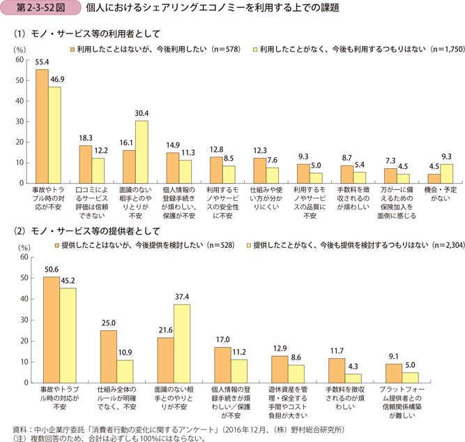
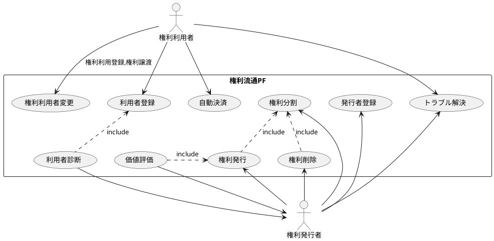
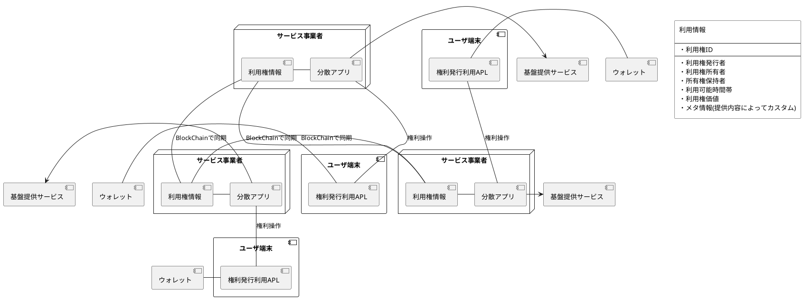
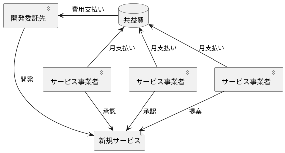
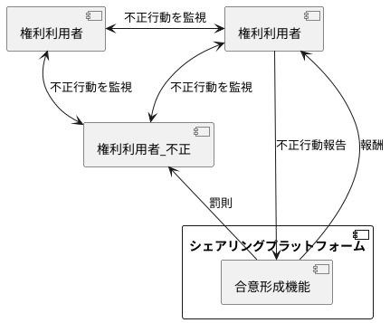
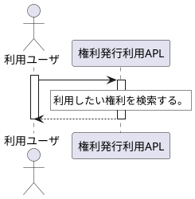

## シェアリングのターゲット

使用期間長

## 現状のシェアリングサービスの課題

個人がシェアリングサービスを利用する又は提供する際に課題として考えいていることは、トラブル対応が最も高い結果となり、利用している人よりも、利用したことがない人のほうが、面識のない人とのやり取りに不安を感じる傾向が強いことがわかる。以下の3点が重要となると考えられる。
- トラブルの解決支援機能
- 面識のない相手を信頼できる仕組み
- 誰にでも扱える簡易な仕組みの構築

## シェアリングプラットフォームの機能

シェアリングプラットフォームで具備すべき機能を以下に定義する。

| ユースケース名 | 概要 |
|---|---|
| 権利発行 | 権利を所有するユーザ又はサービス事業者が権利情報を権利流通PFに登録することにより、 権利利用者が権利の利用登録をすることにより権利の利用を可能とする。 |
| 権利利用者変更 | 権利利用者が権利を利用可能とするために、権利の利用権の所有者を変更する。 |
| 権利分割 | 権利発行者が権利の分割利用を可能とするため、権利を分割する。 ex. 駐車場の1日単位貸し→駐車場15分単位へ変更 |
| 権利削除 | 権利流通PFに登録していた権利情報を削除する。 |
| 利用者登録 | 権利利用者の情報を権利流通PFに登録する。 |
| 利用者診断 | 権利利用者の情報から権利利用者がどのような性格傾向があるかを診断する。 |
| 価値評価 | 権利情報から権利利用権の妥当な基準価格を判断し提供する。 |
| 発行者登録 | 権利を発行するユーザ情報をを登録する。 |
| トラブル解決 | 権利行使時に発生したトラブルを自動的に解決する仕組み。 |
| 自動決済 | 権利の行使を確認後自動的に権利利用料金の決済を行う。 |

## シェアリングプラットフォームの構成

権利情報はBlockChainでノード間で共有する。分散アプリも各ノード上にデプロイされる。各ノード上にデプロイされた分散アプリのAPIは各ユーザ端末上のアプリケーション又はブラウザ上からアクセスされる。

### コンポーネント一覧

| コンポーネント名 | コンポーネント概要 |
|---|---|
| サービス事業者 | サービス事業者は分散APLを作成してユーザへ提供する。 また、ノードとしてBlock Chainに参加し利用権情報をサービス事業者間で共有する。 利用権利情報はBlock Chain上で共有しているのでどのサービス事業者からも参照が可能。 |
| 利用権情報 | サービス事業者が登録した利用権情報を保持する。 利用権利情報はBlock Chainでサービス事業者間で共有される。 |
| 分散アプリ | 利用権の参照用のAPIをユーザに提供する。 利用権の予約、行使開始、行使完了時に自動決済を行う。 |
| ユーザ端末 | 権利利用者又は所有権保持者の端末。 |
| 権利発行利用APL | 権利利用者が分散APLにアクセスして 利用権情報の参照、予約を行うことを可能にするAPL。 所有権保持者が分散APLにアクセスして利用権を 発行することを可能にするAPL。 |
| ウォレット | 権利利用者,所有権保持者が仮想通貨の秘密鍵を 管理するためのウォレット。 |

## プラットフォームの拡大方法

サービス事業者が定期的に費用を共同で積立を行い、プラットフォームに追加したいサービスがあった場合に全事業者に対して提案する。各事業者は提案を受けて承認、非承認を決定し過半数の承認を得られた場合、共益費から新サービス開発委託先に対して開発費が支払われ新サービスの開発を行う。開発したサービスは承認事業者、非承認事業者にかかわらず全ての事業者が機能を利用可能とする。これを繰り返すことでプラットフォーム機能を拡張していく。
サービス仕様書、サービス設計書、契約書のやり取りは全てブロックチェーン上で管理される。
※同じ仕組みを利用ユーザ提供ユーザに対する保険としても適用可能。

## トラブル解決

### 相互監視システム

不正報告に対して過半数の承認を得られれば不正行為として認められ、不正ユーザには罰則が課され不正報告者には報酬が支払われる。報酬、罰則の支払いは自動決済で行われる。

## ユースケースシナリオ
### 利用権登録
### 利用権予約

### 利用権行使
- 利用権使用者が利用権を行使した場合、利用権発行者に対して利用権価値分の支払いを行う。

### 利用権削除

## 検討事項
| No | 検討内容 | 状態 | 状況 |
|---|---|---|---|
| 1 | 利用権情報の登録項目。 | 着手中 | [2019/07/05] 実際のシェアリングサービスでは何を登録させているかを確認する必要がある。 |
| 2 | 利用権情報を保持するプラットフォーム。 | 着手中 |  [2019/07/05] 候補としてはEtherium, ヘデラハッシュグラフ等がある。 ヘデラハッシュグラフのEtheriumとの差分は調査中。 |
| 3 | トラブル自動解決の方法。 | 未着手 | [2019/07/08] ルールエンジンでトラブル解決のためのロジックは組むことができる。 スマートコントラクトのAPIと組み合わせてトラブル自動解決を実施する。 |
| 4 | 利用者の特性分析方法。 | 未着手 | [2019/07/09] Dark Triad(サイコパシー, ナルシシズム, マキャベリアニズム)の パーソナリティ診断で判断できないか検討。 |
| 5 | 発行者, 利用者の個人情報管理方法。 | 未着手 |  |
| 6 | スマートコントラクト上で手数料の定義できるか。 | 未着手 | |
| 7 | 分散されたどのノードへアクセスするかはどう決められるのか。 | 未着手 | |
| 8 | 分散APLから登録されているチェーンの内容を検索できるのか。 | 未着手 | |
| 9 | ハッシュグラフで使用されているゴシッププロトコルでは 相手が受けていないイベントをどうやってしるのか。 | 未着手 | |

## 参考文献
