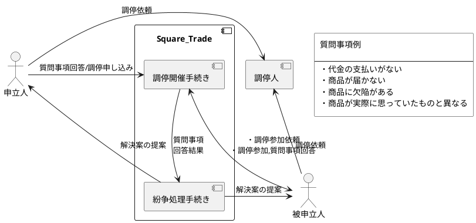

## Square Trade

スクエアトレードでは、まず苦情の申し立てをスクエアトレードのポータル内で行う。そこで苦情申立人は様々な質問事項の回答を行う。質問事項はイーベイの過去の経験を元に作成されている。その後、被申立人はメールで調停に参加するかどうかの回答を求められる。参加する場合は、一緒に送られてくる質問事項に回答を行う。その質問事項を元にどのように紛争を解決するかの選択肢を当事者にスクエアトレードから提案する。イーベイの発表ではここまでの自動化されている調停での解決確率は80%以上である。その提案で納得できない場合、調停人に紛争解決を依頼する。

イーベイではスクエアトレードでの解決を促進するために、事前に手続きに問題があった場合、スクエアトレードでの調停を行うことに合意をとっている。また、スクエアトレードでの解決提案に合意後、その内容を実行しなかった場合やスクエアトレードでの調停に参加しなかった場合はネガティブ・フィードバックが行われるようになっている。

## 考察
イーベイでは質問事項、解決案の提案をこれまでの取引時のトラブルの経験則から決定しているように読み取れる。このため、新規のシステムではデータが無いため機械学習による学習結果での質問事項の回答をインプットとした解決案の分類はすぐにはできない。しかし、人の一般的なトラブル解決の考え方から解決提案は可能なため、ナレッジベースのエキスパートシステム(ルールエンジン)を用いてもある程度、自動解決が可能と考えられる。ただし、認識している知識の誤りや未知の問題についてはエキスパートシステムでは適切に対応できない場合があるため、エキスパートシステムで解決に至らなかった場合の第三者調停での結果を機械学習で学習を行い、その学習結果とエキスパートシステムの併用により解決率を上げていく方法も考えられる。エキスパートシステムと機械学習結果のどちらの結果にどのように重みを置き変化させるかを考える必要がある。

## 参考文献
- [squaretrade 4 step process to resolve disputes](http://web.archive.org/web/20010617043258/http://www.squaretrade.com/cnt/jsp/odr/learn_odr.jsp?vhostid=tomcat3&stmp=squaretrade)
