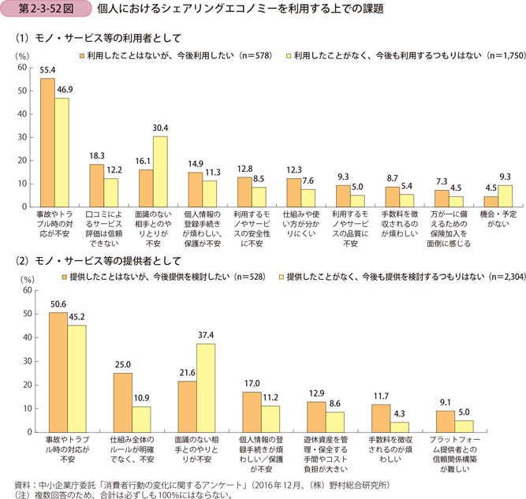
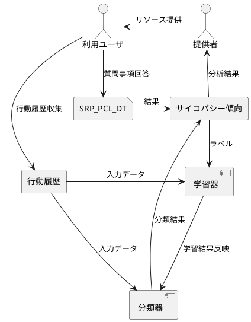
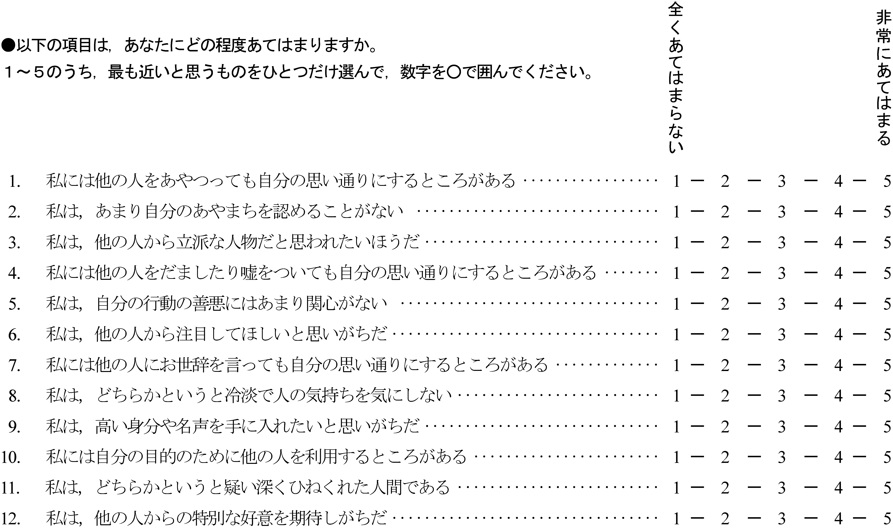
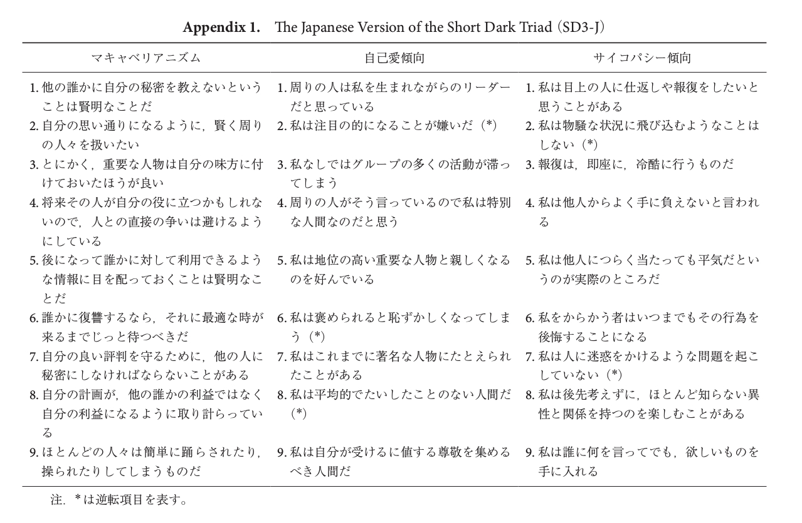

## 性格診断を行う意義
シェアリングの提供者がリソース提供をしたくない理由として事故やトラブル対応が挙げられる。
既存のシェアリング事業者は利用規約に不正利用や費用の未払い等のトラブルを防ぐための規約を記載することでトラブルを未然に防ぐ対策としています。しかし、利用規約を守っているかどうかを確認するすべが不十分なことから、違反すること知りつつ、不正行動を行うユーザも存在しています。また、利用ユーザの増加に合わせ、リテラシの低いユーザが利用者となることも考えられることからトラブルの増加が想定されます。これに対して、利用ユーザが利用規約に違反しない範囲や提供ユーザに不利益を与えないように行動ができるヒトかどうかを確認できる仕組みが必要となります。利用者がこのような行動ができる人かどうかを判断するための指標としての性格分析でサイコパシー特性による診断の利用を検討する。

## サイコパシー傾向

他者との良好な対人関係を形成するためには,他者を援助することと他者に危害を加えないことの双方が重要である。向社会的行動や攻撃性は,このような他者に対する態度や行動を反映する代表的な指標である。向社会的行動は他者への利益や援助を目的とする自発的な行動である攻撃性は他者に危害を加える行動であり,多くの反社会的行動と強く関連する。向社会的行動や攻撃性は対人相互作用のなかで誰しもが選択しうる行動であるが,個人のもつパーソナリティとも密接に関連する。例えば,犯罪と親和性の高いパーソナリティにサイコパシーがあげられる。
サイコパシーは共感性の欠如,感情の希薄さ,他者を自身の利益のために操作するといった他者操作性の高さ,計画性のなさ,衝動性などによって定義される。このため、サイコパシー傾向の高い人ほど規約に違反し不正行動を行う、提供ユーザに不利益を与える可能性が高いと考えられる。

## サイコパシー傾向診断

サイコパシーの傾向診断としては以下の診断方式が存在している。

| 診断方式名 | 概要 | 参考 |
|---|---|---|
| Self-Report Psychopathy Scales Ⅲ (SRP-Ⅲ) | PCL-R と高い並存的妥当性が確認された評価方式。 64項目の評価尺度から判断する。 | [Validity of the Self-Report Psychopathy Scales (SRP-III Full and Short Versions) in a Community Sample](SRP2015Gordtsetal.pdf) |
| Self-Report Psychopathy Scales Short Form (SRP-SF)  | SRP-Ⅲの短縮版。28項目の評価尺度から判断する。 | [Validity of the Self-Report Psychopathy Scales (SRP-III Full and Short Versions) in a Community Sample](SRP2015Gordtsetal.pdf) |
| Psychopathy Checklist-Revised(PCL-R) | サイコパシーとしての精神病質者、反社会性、人格障害などを評定する、 世界的に認められた検査。125項目の質問項目から構成。 |[HARE PCL-R 第2版 日本語版](https://www.f-sinri.jp/individual/261.html)

## シェアリングエコノミーへの適用

サイコパシーの傾向診断を適用する場合、質問項目が多岐に渡る場合や内容や回答に負担がかかるような内容の場合は、シェアリングを利用している人にとって障壁になる可能性があるため、できるだけユーザに負担がかからない且つ回答の操作による診断結果の詐称が困難になるものである必要がある。質問紙法ではユーザが何らかのパーソナリティ診断を行われていることが意識できてしまうため、それ以外のユーザが何も意識せず行っている行動や言動から診断可能となることが望ましい。

### 案1：質問紙法の診断結果の学習結果を利用した行動履歴によるパーソナリティ診断

1. 学習期
    - 試験ユーザに質問紙法で回答をしてもらいサイコパシー傾向を診断する。
    - 試験ユーザから行動履歴を収集する。
    - 行動履歴をインプットデータ、診断結果をラベルとして学習器に入力しどのような行動履歴がサイコパシー傾向に影響するかを学習する。
    - 学習結果は分類器を反映させる。
1. 運用期
    - シェアリング利用者の行動履歴を収集する。
    - 行動履歴を分類器に入力データとすることで、利用ユーザにどのようなサイコパシー傾向があるかを分類する。
    - 分類器が出したサイコパシー傾向を元に提供者は利用ユーザにリソースを貸し出すかどうかを決定する。

### 課題
- 何を分析対象の行動履歴として利用するのか。(スマホの使用履歴、Webの閲覧行動履歴等)
- 学習器で使用するアルゴリズムは何が適切か。(Deep-Learing等)
- PCL-Rの質問事項のリストは閲覧に購入資格が必要そうである。SRP-SF,SRP-Ⅲは日本語版が刊行されていない。
- テストデータはどのようにして収集するか。機械学習を行う場合、膨大な量の学習データが必要になる。

## Dark Triad(人間が持つ３つの暗黒面)
サイコパシー、ナルシシズム、マキャベリアニズムの3つ。各々独自性があることが論文では主張されている。診断方法としては以下のDark Triad Dirty Dozen,Short Dark Triadが提案されている。いずれも質問紙法による診断方法。サイコパシーの反社会的傾向、マキャベリアニズムの傾向が高い人は合理的且つ計画的に他人を騙す傾向があるため、質問紙法の回答も詐称する可能性があると考えられる。
- サイコパシー
共感性の欠如，他者操作性，不安定なライフスタイル（衝動性），反社会的傾向
- ナルシシズム
尊大さ，自己顕示欲，特権意識
- マキャベリアニズム
過度な自己中心性と自己のための合理的判断

### 日本語版Dark Triad Dirty Dozen

### 日本語版Dark Triad Dirty Dozen

## 参考
- [サイコパシー特性と非道徳的行動の関係に対するサポートの調整効果](https://www.google.com/url?sa=t&rct=j&q=&esrc=s&source=web&cd=1&ved=2ahUKEwiptsbAxZfjAhXHzLwKHbV7Dg8QFjAAegQIABAB&url=https%3A%2F%2Fwww.jstage.jst.go.jp%2Farticle%2Fjjpsy%2F89%2F1%2F89_89.16003%2F_pdf%2F-char%2Fja&usg=AOvVaw3nywzdFudoXA0P1ui50lyO)
- [パーソナリティ研究冊子](https://www.jstage.jst.go.jp/browse/personality/-char/ja)
- [Dark Triadのライフスキルに対する関連―反社会的な性格特性の適応的，不適応的側面に関する探索的検討](https://www.jstage.jst.go.jp/article/personality/27/3/27_27.3.10/_article/-char/ja)
- [日本語版 Short Dark Triad (SD3-J) の作成](https://www.jstage.jst.go.jp/article/personality/26/1/26_26.1.2/_article/-char/ja)
- [日本語版Dark Triad Dirty Dozen (DTDD-J) 作成の試み](https://www.jstage.jst.go.jp/article/personality/24/1/24_26/_article/-char/ja/)
