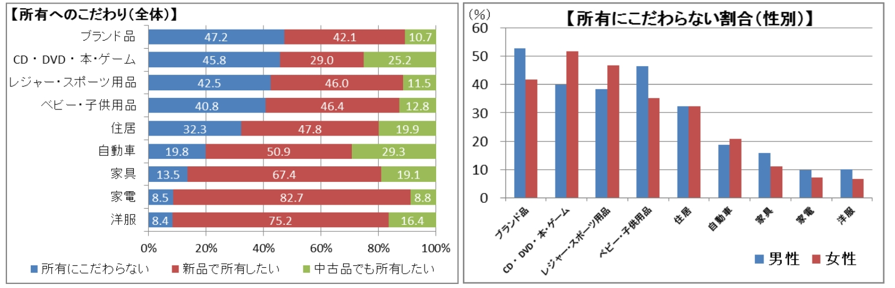
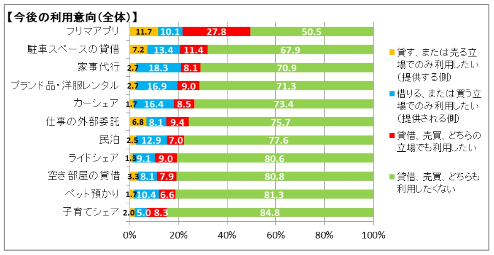
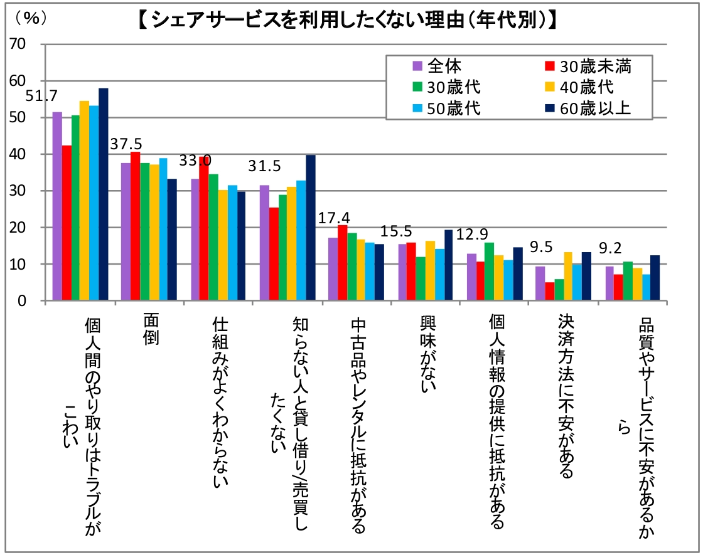

## 所有へのこだわり
ものの所有についての考え方についてアンケート調査を行った結果、所有にこだわらないものの上位は、1位 ブランド品(47.2%)、2位 CD・DVD・本・ゲーム(45.8%)、3位 レジャー・スポーツ用品(42.5%)、4位ベビー・子供用品(40.8%)となった。上位には趣味のものや一時的にしか使わないもの、中位には住居や自動車などの高価なもの、下位には家電や洋服などの身の回り品が多い傾向がある。所有にこだわらないものについては、シェアリングに抵抗がなく、所有にこだわるものについてはシェアリングに抵抗があるものと考えることができる。

## 今後の利用意向

今後、借りる又は貸すことでシェアリングを利用したいかを調査した結果、フリマアプリ以外は7割近く又は以上の人が利用したくないという回答となった。また、貸す立場よりも借りる立場での利用を考えている人のほうが多い割合となっていることから借りることよりも貸すことによる抵抗のほうが大きいと考えられる。

シェアリングサービスを利用したくない理由としては、最も多い個人間トラブルを先頭に面倒、仕組みが不明瞭、知らない人との貸し借りの不安が上位となった。このため、シェアリングプラットフォームとしてはトラブルの解決支援の仕組み、簡易でわかりやすいシステム、面識の無い相手でも安全な取引を保証できる仕組みの構築が必要となる。

## 利用者の課題感と提供者の課題感

個人がシェアリングサービスを利用する又は提供する際に課題として考えいていることは、トラブル対応が最も高い結果となり、利用している人よりも、利用したことがない人のほうが、面識のない人とのやり取りに不安を感じる傾向が強いことがわかる。

## 参考文献
- [シェアリングエコノミーに関するアンケート調査 - 株式会社 十六総合研究所](https://www.google.com/url?sa=t&rct=j&q=&esrc=s&source=web&cd=3&ved=2ahUKEwijl9mVqZjjAhVI6LwKHaWvC_oQFjACegQIBRAC&url=http%3A%2F%2Fwww.16souken.co.jp%2Fpdf%2Fjuroku_report20171019_01.pdf&usg=AOvVaw0Mk1Z_Kwkey5l3p3KbjiHP)
- [シェアリングエコノミーの認知度と活用に向けた課題](https://www.chusho.meti.go.jp/pamflet/hakusyo/H29/h29/html/b2_3_4_3.html)
