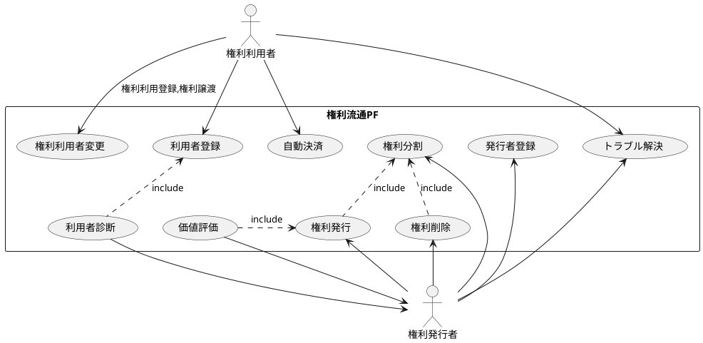
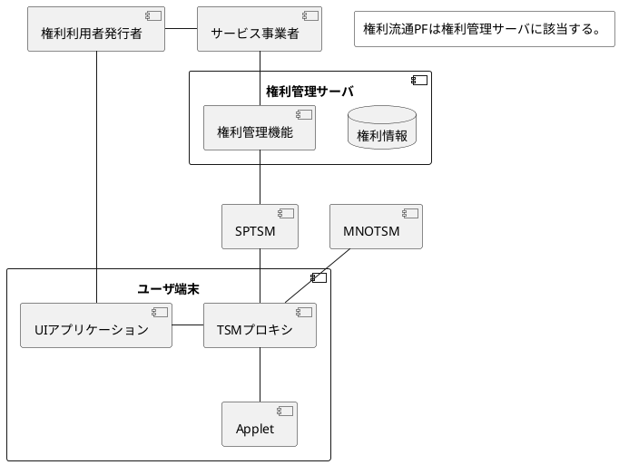
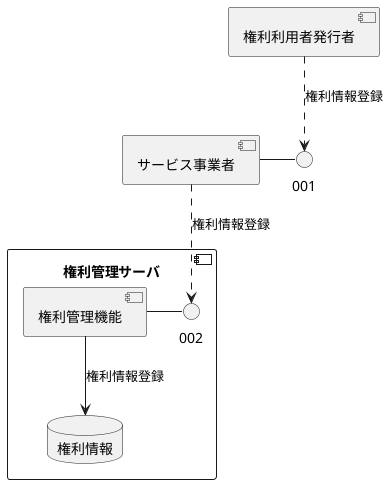
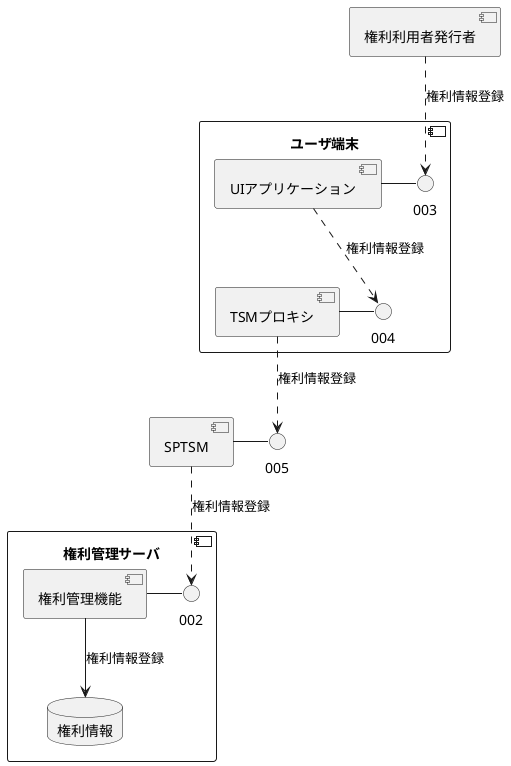
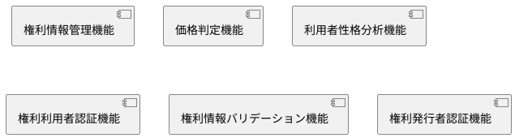
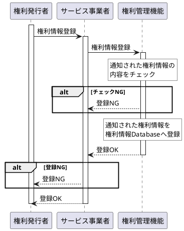
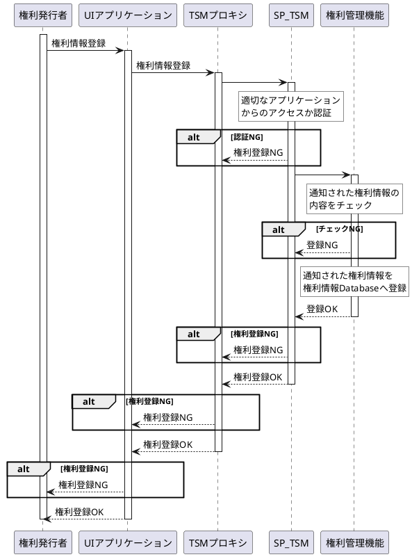
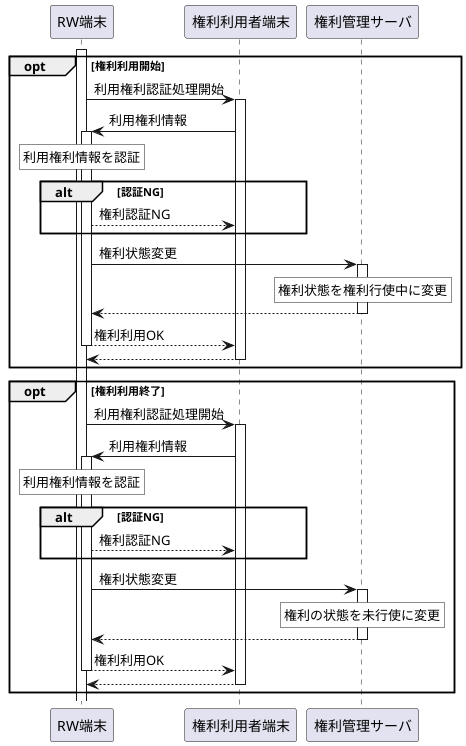

# ユースケース図

## ユースケース一覧

| ユースケース名 | 概要 |
|---|---|
| 権利発行 | 権利を所有するユーザ又はサービス事業者が権利情報を権利流通PFに登録することにより、 権利利用者が権利の利用登録をすることにより権利の利用を可能とする。 |
| 権利利用者変更 | 権利利用者が権利を利用可能とするために、権利の利用権の所有者を変更する。 |
| 権利分割 | 権利発行者が権利の分割利用を可能とするため、権利を分割する。 ex. 駐車場の1日単位貸し→駐車場15分単位へ変更 |
| 権利削除 | 権利流通PFに登録していた権利情報を削除する。 |
| 利用者登録 | 権利利用者の情報を権利流通PFに登録する。 |
| 利用者診断 | 権利利用者の情報から権利利用者がどのような性格傾向があるかを診断する。 |
| 価値評価 | 権利情報から権利利用権の妥当な基準価格を判断し提供する。 |
| 発行者登録 | 権利を発行するユーザ情報をを登録する。 |
| トラブル解決 | 権利行使時に発生したトラブルを自動的に解決する仕組み。 |
| 自動決済 | 権利の行使を確認後自動的に権利利用料金の決済を行う。 |

# コンポーネント図

## コンポーネント一覧

| コンポーネント名 | 機能概要 |
|---|---|
| 権利利用者/発行者 | 権利を利用するユーザ、権利を発行するユーザ |
| サービス事業者 | 権利発行、検索、利用予約のIFを権利利用者、発行者に提供する。 |
| 権利管理サーバ | 権利情報を一元管理する。 |
| SP-TSM |  |
| MNO-TSM |  |
| サービス事業者 |  |
| サービス事業者 |  |

## 権利発行

権利発行者がサービス事業者のAPIを経由して権利情報を登録する場合。

権利発行者が自端末のUIアプリケーションのAPIを経由して権利情報を登録する場合。

## IF一覧

| IF通番 | IF保有CP | IF利用CP | プロトコル | 用途 |
|---|---|---|---|---|
| 001 | サービス事業者 | 権利利用者発行者 | HTML(REST) | 権利発行,変更,削除,検索 |
| 002 | 権利管理サーバ | サービス事業者 SP TSM | HTML(REST) |  権利発行,変更,削除,検索 |
| 003 | UIアプリケーション | 権利利用者発行者 | GUI |  権利発行,検索,利用登録 |
| 004 | TSMプロキシ | UIアプリケーション | HTML(REST) |  HTML(REST)プロキシ |
| 005 | SP TSM | TSMプロキシ | HTML(REST) | 権利発行,変更,削除,検索  |

## 権利流通PF

# シーケンス図
## 権利発行(サービス事業者経由)
- 処理概要
権利所有者がサービス事業者を経由して権利を発行する。

## 権利発行(UIアプリ経由)
- 処理概要
権利所有者がUIアプリを使用して権利を発行する。

## 権利行使

## 検討事項

1. 権利情報のマスターをUICCに持つかそれとも権利管理サーバに持つか。

| 方式 | 機能性 | 信頼性 | 使用性 | 効率性 | 保守性 | 移植性 |
|---|---|---|---|---|---|---|
| UICCに権利情報保持 | ○ | △ 端末故障、電源断時に 機能が満たせない  | ○ | △ 端末主導の処理は 処理性能が端末依存になる。 使えるリソースも少ない。 | × 権利管理PFのソフトウェアに 変更が入った場合、すべての端末で UPDATEが必要。  | ○ |
| 権利管理サーバに権利情報保持 | ○ | ○ | ○ | ○ | ○ | ○ |

- 機能性
ソフトウェアを指定された条件のもとで動作するとき、要求されている仕様を満たす能力のこと。
- 信頼性
ソフトウェアを指定された条件のもとで動作するとき、達成水準を維持し続ける能力のこと。誤作動時の復旧や、障害に対する許容性をあらわす場合もある。
- 使用性
ソフトウェアを指定された条件のもとで動作するとき、利用者が理解、習得、利用がスムーズにおこなえる能力こと。いわゆる「使い勝手」や「使いやすさ」、「操作性」のこと。
- 効率性
与えられたリソースに対して、適切な性能を発揮する能力のこと。たとえば、決められた処理時間の中でいかに早く、数多くの処理ができるか、などがあります。
- 保守性
できたソフトウェアの修正のしやすさの能力のこと。作った本人しか理解できないプログラムでは、改修が発生した際に多くのコストがかかってしまいます。これは利用者には直接は関係しない特性のように見えますが、最終的なサービスリリースまでにかかるコストの軽減は、利用者へのメリットにつながることが多くあります。
- 移植性
別な環境へ移すことになった際に、容易に移せる能力のこと。サーバーの移行や、使うフレームワークが変更になった場合などに重要になってくる。
