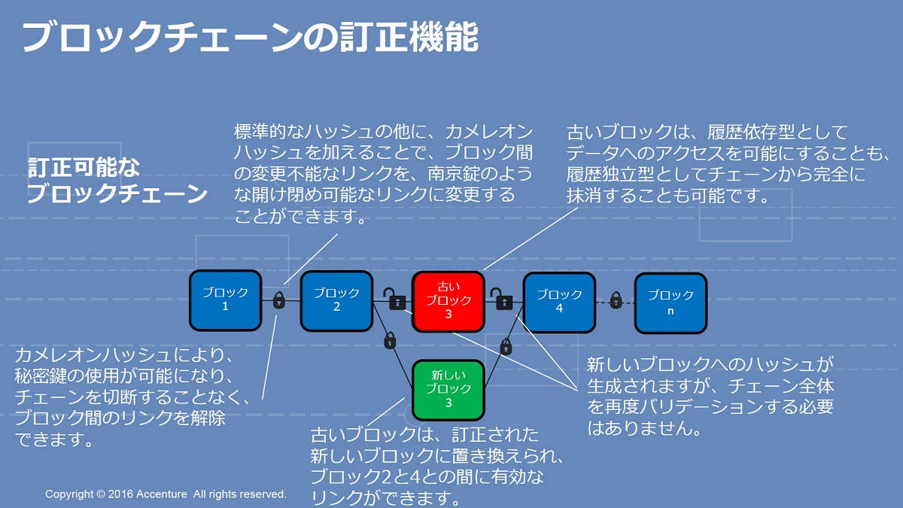
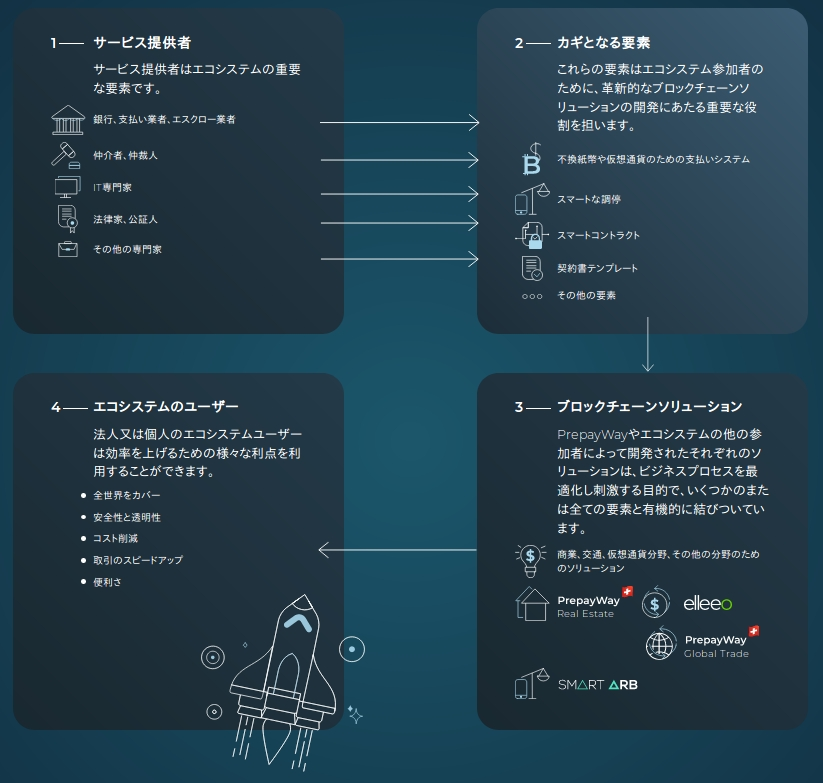
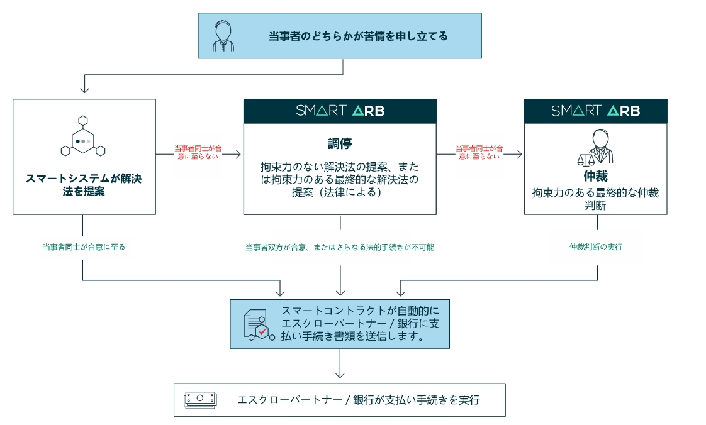

## キーワード

### ヘデラハッシュグラフ

- ヘデラ・ハッシュグラフ
ヘデラ・ハッシュグラフは全く新しい同意形成の方法を提供するプラットフォームです。
中央管理者不在（第三者が間を取り持たなくても）のネットワークにおいても、お互いを知る必要も信頼する必要もなく安心して共同作業や取引を行い、合意形成を可能にする方法です。私たちが提供するプラットフォームは超高速、安全（セキュア）、公平、そして他のブロックチェーンの基礎になっている膨大な資源を使用するプルーフオブワークが不要です。ヘデラ・ハッシュグラフは今までに開発が不可能な分散アプリ（Dapps)の開発を可能にし、アプリ開発者に新しい技術革新の可能性と術をを提供します。  
- ヘデラ・ハッシュグラフプラットフォーム
ヘデラ・ハッシュグラフは全く新しい形の分散コンセンサスを提供します。中央管理者不在のネットワークにおいても、お互いを知る必要も信頼する必要もなく安心して共同作業や取引を行い、合意形成を可能にする方法です。私たちが提供するプラットフォームは超高速、安全（セキュア）、公平、そして他のブロックチェーンの基礎になっている膨大な資源を使用するプルーフオブワークが不要です。ヘデラ・ハッシュグラフは今までに開発が不可能な分散アプリ（Dapps)の開発を可能にし、アプリ開発者に新しい技術革新の可能性と術をを提供します。

#### 参考資料

- [ヘデラハッシュグラフ White Paper](jounal/hh-whitepaper-v1.4-181017.pdf)
- [ヘデラを活用して業界「破壊」を引き起こす７つの分散型アプリ](https://blog.hedera.asia/dapps-building-on-hedera-hashgraph)

### カメレオンハッシュ

ブロックチェーンで通常使われるハッシュチェーンは改ざん不能なようにブロックどうしを結び付けるが、カメレオンハッシュでは、管理者だけが持つ暗号鍵により「鍵」の開け閉めができる機能を提供する。過去のブロックを結び付けたカメレオンハッシュの「鍵」を開けてブロックの連鎖をつなぎ変えることで、過去の情報を訂正する。なお、この操作を行うと、カメレオンハッシュではない従来型のハッシュチェーンは壊れてしまうが、これは後から訂正箇所が発見できることを意味する。つまり、無制限に訂正を許すわけではなく、必要最低限の訂正をハードフォークなしに実現するということだ。

#### 参考資料

- [議論を呼ぶ「訂正できる」ブロックチェーン、そのメカニズムとは？](https://www.itmedia.co.jp/enterprise/articles/1612/07/news004_4.html)

### PrepayWay
不動産取引から国際商取引まで幅広くサポートするブロックチェーンプラットフォーム。

#### スマートコントラクトにおける紛争の法的な解決方法

PrepayWayは、国際ビジネス紛争に対する代替紛争解決（ADR）サービスのためのインテリジェントシステムを提供しています。スマート契約では、SmartArb仲裁仲裁条項をコード形式で使用して、スマート契約にセキュリティの層を追加し、紛争が迅速かつ公正に解決されるようにすることができます。SmartArbは、国際的な調停および仲裁における独立した認定専門家のネットワークを網羅し、世界中の企業に公平で効率的で信頼性の高い紛争解決サービスの段階的システムを提供します。次のフローチャートは考えられるいくつかの紛争解決シナリオの一例を示しています。

#### 参考資料

- [PrepayWayブロックチェーンエコシステムはどのように機能しているのか？ ](https://prepayway.com/ja/system)
- [国際仲裁協会SmartArb](https://smartarb.org/)
- [Prepay white paper](https://prepayway.com/PrepayWay_Blockchain_Ecosystem_Whitepaper_EN.pdf)

### キーワード

#### 参考資料

- [参考資料](リンク先)
